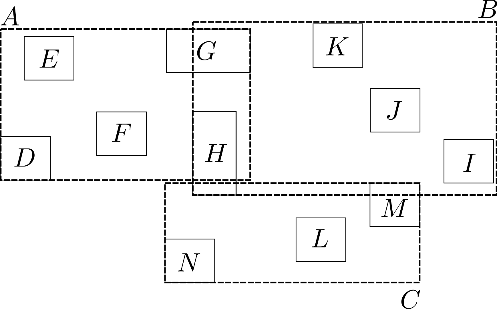
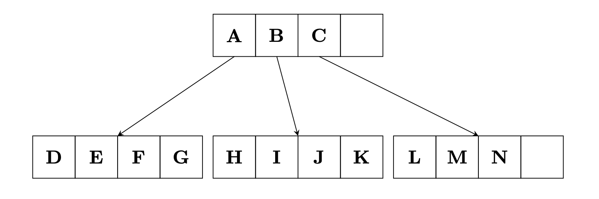
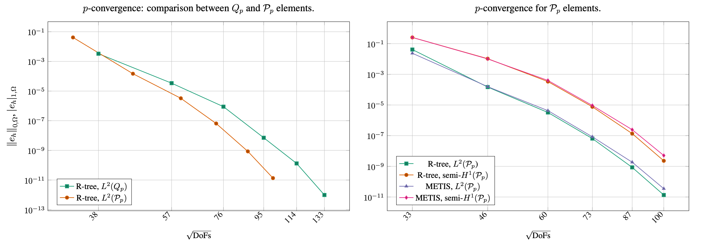
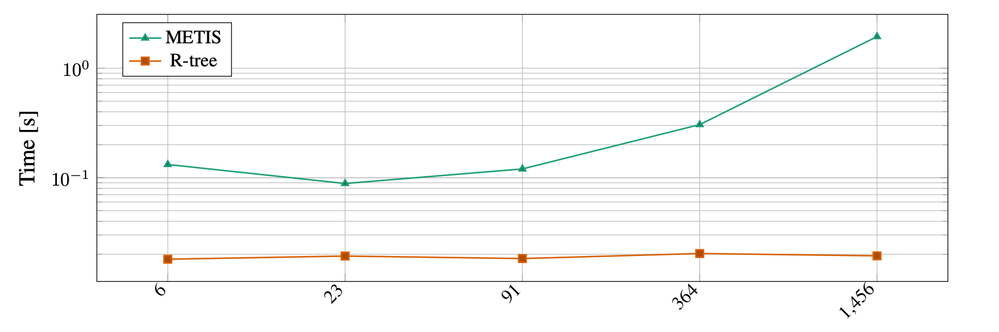
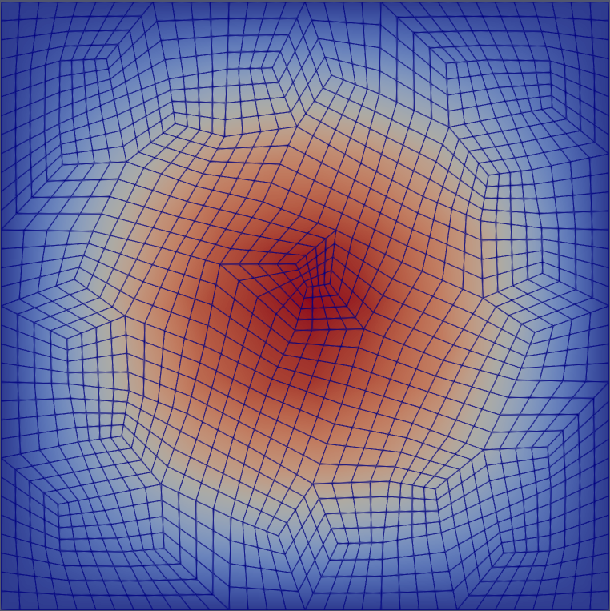

# Polytopic Mesh DG Solver for Poisson

This program solves a Poisson problem on an agglomerated polytopal mesh
using a symmetric interior penalty discontinuous Galerkin (SIPDG) method.
Agglomerates are constructed by an R-tree based spatial indexing
strategy, following the approach proposed in [2].
In addition, a graph-based METIS partitioner is also provided in this program for comparison.

## Running the code:

As in the tutorial programs, type

`cmake -DDEAL_II_DIR=/path/to/deal.II .`

on the command line to configure the program. After that you can compile with `make` and run with either `make run` or using

`./agglomeration_poisson`

on the command line.

## Program output

Running the program produces two kinds of output:

- terminal output (text summary),
- visualization files (`.vtu`).

The program prints a short summary including:

- the finite element degree (`FE degree`);
- the triangulation size (`Size of tria`);
- the agglomeration construction time (R-tree build time);
- the number of agglomerated subdomains (`N subdomains`);
- the number of DoFs per cell;
- the assembly time;
- a convergence table with `#DoFs`, `L2 error`, and `H1 error`.

The program writes two `.vtu` files for each run:

- `grid_<partitioner>_<n_subdomains>.vtu`, containing the agglomerated mesh
  partition information (cell-wise agglomeration labels);
- `interpolated_solution_<partitioner>_<n_subdomains>.vtu`, containing the
  numerical solution interpolated to the fine grid together with agglomerate
  labels for visualization.

These files can be visualized in ParaView to inspect both the agglomeration
structure and the computed solution.

## Problem description:

We consider the Poisson problem in a bounded, simply connected domain
@f$\Omega \subset \mathbb{R}^d @f$, @f$d = 2,3@f$.
The strong formulation reads
@f{align*}
  -\Delta u &= f  && \text{in } \Omega, \\
           u &= u_D && \text{on } \partial\Omega,
@f}
where the right-hand side satisfies @f$f \in L^2(\Omega) @f$ and the prescribed
Dirichlet data satisfy @f$u_D \in H^{1/2}(\partial\Omega) @f$.

The corresponding weak formulation is: find @f$u \in H^1(\Omega)@f$ with
@f$u = u_D @f$ on @f$\partial\Omega @f$ such that
@f{equation}
  \int_{\Omega} \nabla u \cdot \nabla v \,\mathrm d\mathbf{x}
  =\int_{\Omega} f\, v \,\mathrm d\mathbf{x}
  \qquad \text{for all } v \in H_0^1(\Omega).
@f}

## SIPDG discretization on agglomerated polytopic meshes:

We discretize the weak formulation by a symmetric interior penalty
discontinuous Galerkin (SIPDG) method on the agglomerated polytopal mesh
@f$T_h @f$, whose elements @f$K \in T_h @f$ are mutually disjoint
open polygons (for @f$d=2 @f$) or polyhedra (for @f$d=3 @f$).
For each element we denote its diameter by
@f{align*}
  h_K := \operatorname{diam}(K).
@f}
The mesh skeleton is defined by
@f{align*}
  \Gamma := \bigcup_{K \in T_h} \partial K.
@f}
The mesh skeleton @f$\Gamma @f$ is decomposed into @f$(d-1)@f$–dimensional simplices @f$F @f$ denoting the mesh faces, shared by at most two elements. These are distinct from elemental interfaces, which are defined as the simply connected components of the intersection between the boundary of an element and either a neighboring element or @f$\partial \Omega @f$. As such, an interface between two elements may consist of more than one face, separated by hanging nodes/edges shared by those two elements only.
We denote by @f$\Gamma_{\mathrm{int}}@f$ the union of all interior facets, and by
@f$
  \Gamma_{\mathrm D} := \Gamma \cap \partial\Omega
@f$
the union of Dirichlet boundary facets.

The discrete space @f$V_h @f$ consists of element-wise polynomials of degree
at most $p$ on each @f$K \in T_h @f$. For @f$u_h, v_h \in V_h @f$ we use
the broken gradient @f$\nabla_h @f$ and the standard jump and average
operators @f$[\![\cdot]\!]@f$ and @f$\{\!\!\{\cdot\}\!\!\}@f$ on faces.

The DG formulation reads: find @f$u_h \in V_h @f$ such that
@f{equation}
  B(u_h,v_h) = l(v_h)
  \qquad \forall\, v_h \in V_h,
@f}
with
@f{align*}
  B(u_h,v_h)
  &=
  \int_{\Omega} \nabla_h u_h \cdot \nabla_h v_h \,\mathrm d\mathbf{x}
  \\
  &\quad
  - \int_{\Gamma}
    \Bigl(
      \{\!\!\{\nabla u_h\}\!\!\} \cdot [\![v_h]\!]
      +
      \{\!\!\{\nabla v_h\}\!\!\} \cdot [\![u_h]\!]
    \Bigr)\,\mathrm d s
  \\
  &\quad
  + \int_{\Gamma} \sigma \,[\![u_h]\!] \cdot [\![v_h]\!] \,\mathrm d s,
@f}
and
@f{equation}
  l(v_h)
  =
  \int_\Omega f\, v_h \,\mathrm d\mathbf{x}
  +
  \int_{\Gamma_{\mathrm D}}
    u_D \bigl(\sigma v_h - \nabla v_h \cdot \mathbf n\bigr)\,\mathrm d s.
@f}

The penalty parameter is chosen as
@f{equation}
  \sigma(\mathbf x) = C_\sigma
  \begin{cases}
    \dfrac{p^2}{h_K}, &
      \text{if } \mathbf x \in \partial K \cap \partial\Omega, \\[0.5em]
    \dfrac{p^2}{\min\{h_K^+,h_K^-\}}, &
      \text{if } \mathbf x \in \Gamma_{\mathrm{int}},
  \end{cases}
@f}
where @f$h_K^\pm @f$ are the diameters of the two elements sharing the
interior face, $p$ is the polynomial degree, and we fix @f$C_\sigma = 10 @f$ in this program.

This scheme is well posed and admits optimal-order a priori error
estimates. More precisely, assuming that @f$u|_K \in H^{s+1}(K) @f$ for all
@f$K \in \mathcal{T}_h @f$ and some @f$1 \le s \le p @f$, there exists a constant
@f$C > 0 @f$, independent of @f$h @f$, such that
@f[
  \|u - u_h\|_{L^2(\Omega)}
  \le C\, h^{s+1} \, |u|_{H^{s+1}(\Omega)},
@f]
and
@f[
  \|\nabla(u - u_h)\|_{L^2(\Omega)}
  \le C\, h^{s} \, |u|_{H^{s+1}(\Omega)}.
@f]
We refer to~[1] for details of the analysis.

## Agglomeration strategies
Agglomeration is a key ingredient for constructing polytopic meshes.
This program supports two strategies for generating agglomerates,
corresponding to the choices `metis` and `rtree`. In this example, we
mainly focus on the `rtree` strategy, which is the method developed and
introduced in the work [2].

### R-tree-based agglomeration
#### Basic idea and data structure
In the `rtree` option, axis-aligned bounding boxes of all fine cells are
inserted into a spatial R-tree. Agglomerates are obtained by grouping the
cells whose bounding boxes belong to the same node at a user-selected
extraction level of the tree. This purely geometric strategy does not
require external graph partitioners and is typically fast and scalable.
The number and shape of the agglomerates are determined by the R-tree
structure and the chosen level.

This approach is particularly suitable for multilevel methods, where a *nested*
agglomerated hierarchy is desirable.

At the data-structure level, we distinguish leaf nodes and internal nodes:

- **Leaf nodes** store the geometric objects (here, mesh cells or their bounding boxes).
- **Internal nodes** store:
  - a pointer (or reference) to a child node,
  - a bounding box that encloses all entries contained in that child subtree.

As a result, each internal node represents a spatial grouping of the objects below it.

#### Design targets
The R-tree is used here as a geometry-aware structure for grouping cell bounding boxes.
The main design targets are:

- **Minimize box area**: reduce the area covered by each bounding box,
- **Minimize overlap**: reduce overlap between neighboring boxes,
- **Improve compactness**: reduce box perimeters (equivalently, favor more compact boxes).

These criteria improve the spatial quality of the hierarchy and typically lead to better grouping and query behavior.

To make the R-tree construction more intuitive, we first illustrate the relation
between geometric objects, their minimum bounding rectangles (MBRs), and the
corresponding R-tree hierarchy. The left image shows geometric objects together
with their enclosing MBRs, while the right image shows the associated tree
structure (leaf and internal nodes). This visual example helps explain how the
hierarchical grouping is later used to extract agglomerates.

  
  
   
  <em>(1) Examples of MBRs holding geometric data and their MBRs</em>
  <em>(2) Corresponding R-tree data structure elements</em>
   

#### Agglomeration extraction
Given a collection of cells (or cut-cell bounding boxes), we:

1. build an R-tree from their bounding boxes,
2. choose a target tree level,
3. recursively descend each node at that level to its leaf descendants,
4. agglomerate leaf cells that share the same ancestor.

This produces a sequence of nested agglomerated meshes, which can be used in multilevel solvers and preconditioners.

For the agglomeration workflow considered here, the R-tree-based extraction has the following practical features:

- **Level-independent extraction cost (observed)**: the wall-clock time is approximately constant with respect to the chosen extraction level.
- **Boost.Geometry backend**: the implementation relies on the `Boost.Geometry` R-tree.
- **Custom traversal logic**: hierarchy traversal in the form needed for agglomeration is not directly exposed, so a custom node visitor is implemented.

These properties make the R-tree approach convenient for constructing nested agglomerated meshes in multilevel finite element and DG settings.

#### Algorithmic pipeline

Given a collection of fine-level cells (or cut-cell bounding boxes), we proceed as follows:

- **Step 1: Build the R-tree**
  Construct an R-tree from the set of bounding boxes associated with the fine-level cells.

- **Step 2: Select a target level**
  Choose a tree level $l\in {1,\dots,L}$ to control the agglomeration granularity.

- **Step 3: Collect leaf descendants**
  For each node on level $l$, recursively traverse its children until leaf nodes are reached.

- **Step 4: Agglomerate by common ancestor**
  Merge leaf cells that belong to the same subtree (same ancestor at level $l$).

This yields a nested hierarchy with natural parent-child relations across levels.

Using an R-tree in the agglomeration pipeline has two practical advantages:

- it provides a natural hierarchy over the fine-level mesh entities,
- it enables geometry-aware grouping through recursive subtree extraction.

This is the key mechanism used later to build nested agglomerated meshes for multilevel methods and DG discretizations.

For illustration, the following images show the R-tree based agglomeration on a structured fine mesh:

  
  
   
  <em>(3) Original 8x8 mesh</em>
  <em>(4) Bounding boxes and mesh elements</em>
   
  
   
  <em>(5) Tree hierarchy: root node, internal nodes, and leaf nodes from top to bottom (only two child subtrees of the root are shown for clarity)</em>
   

Figures (3)-(5) show, respectively, the original fine mesh, the blocks induced
by the R-tree on the cell bounding boxes, and the corresponding tree structure.

### METIS-based partitioning
In the `metis` option, the adjacency graph of the fine mesh is constructed
with one vertex per cell and edges between face-neighboring cells.
This graph is then partitioned by the multilevel graph partitioner METIS
into a prescribed number of parts, and each part defines one agglomerate;
see [3] for details.

## Test case:

We consider the Poisson problem on the unit square @f$\Omega = (0,1)^2 @f$
with the manufactured exact solution
@f[
  u(x,y) = \sin(\pi x)\sin(\pi y).
@f]
The corresponding right-hand side is
@f[
  f(x,y) = 2\pi^2 \sin(\pi x)\sin(\pi y).
@f]
This manufactured solution allows us to compute the global
@f$L^2 @f$- and @f$H^1 @f$-seminorm errors of the discrete solution in order to
assess the quality of the numerical approximation.

In this example, an unstructured fine mesh (e.g., a triangular mesh) is used as
the starting point. Agglomerates are then constructed by METIS and by the
R-tree strategy, leading to different polytopal meshes. The following images
compare the resulting agglomerates on the same underlying mesh for two
different agglomeration sizes (91 and 364 agglomerates).

<h4>Comparison of agglomeration strategies</h4>

  
  
   
  <em>(6) METIS, 91 agglomerates</em>
  <em>(7) METIS, 364 agglomerates</em>
   

  
  
   
  <em>(8) R-tree, 91 agglomerates </em>
  <em>(9) R-tree, 364 agglomerates</em>
   

These plots illustrate how the two strategies distribute and shape the
agglomerates on the same mesh. In particular, the R-tree approach produces
geometry-driven groupings induced by the spatial hierarchy, while METIS
produces graph-based partitions of the cell adjacency graph.

To assess the discretization accuracy, we next compare the error behavior under
mesh refinement and polynomial refinement. The plots below are obtained by
collecting the program outputs over multiple runs and post-processing the
reported error data.

  
   
  <em>(10) h-convergence for \(Q_p\) elements (\(p=1,2,3\)) with METIS and R-tree agglomeration</em>

The figure reports the \(L^2\)- and \(H^1\)-seminorm errors with respect to the
manufactured solution \(u\). Optimal convergence rates are observed for all
polynomial degrees and for both agglomeration strategies. In addition, the
curves associated with the R-tree approach are consistently lower than or
comparable to those obtained with METIS-based partitioning.

  
   
  <em>(11) p-convergence comparison for \(Q_p/P_p\) elements (\(p=1,2,3\)) with different agglomeration strategies</em>

In addition to accuracy, the cost of constructing the agglomerated polytopal
meshes is also relevant in practice. The following timing plot compares the
wall-clock time required by the R-tree and METIS strategies. The timing values
are collected from the program outputs and summarized in post-processing.

  
   
  <em>(12) Wall-clock time (seconds) for building polytopal grids with R-tree and METIS</em>

Finally, the program also writes VTU files that can be visualized in ParaView.
The next figure shows the interpolated solution field `u` on the agglomerated
mesh (`interpolated_solution_rtree_91.vtu`), rendered with `Surface With Edges`.

  
   
  <em>(13) Interpolated solution field `u`</em>

The construction of an R-tree spatial index on an arbitrary fine grid
provides a natural and efficient agglomeration strategy with the
following features:

- fully automated, robust, and dimension-independent;
- it produces a balanced and nested hierarchy of agglomerates;
- the shape of the agglomerates closely follows their axis-aligned
  bounding boxes.

These properties make the R-tree approach an attractive alternative to
graph-based agglomeration methods (see [3] for more details).

## References
* [1] Di Pietro, Daniele Antonio and Ern, Alexandre (2012), Mathematical Aspects of Discontinuous Galerkin Methods. ISBN: [978-3-642-22980-0](https://www.springer.com/gp/book/9783642229794)
* [2] Marco Feder, Andrea Cangiani and Luca Heltai (2025), R3MG: R-tree based agglomeration of polytopal grids with applications to multilevel methods. DOI: [10.1016/j.jcp.2025.113773](https://doi.org/10.1016/j.jcp.2025.113773)
* [3] George Karypis and Vipin Kumar, A fast and high quality multilevel scheme for partitioning irregular graphs. DOI: [10.1137/S1064827595287997](https://doi.org/10.1137/S1064827595287997)
