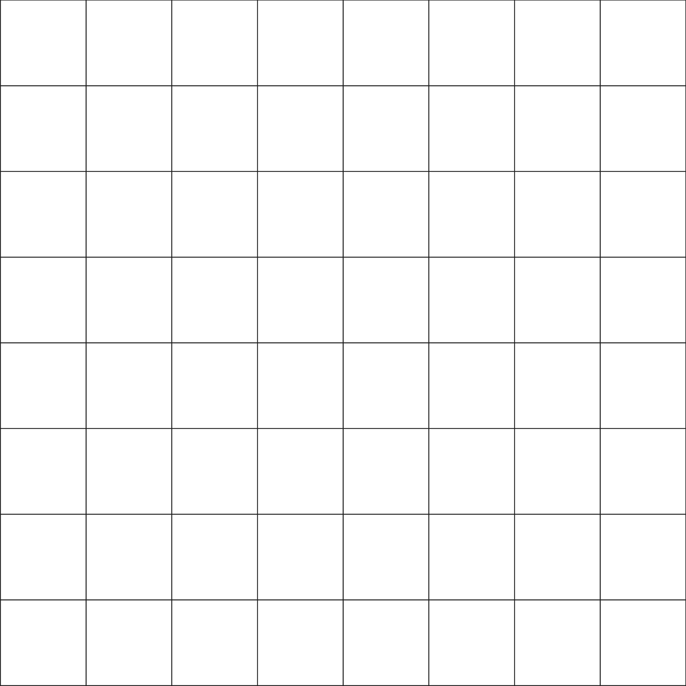
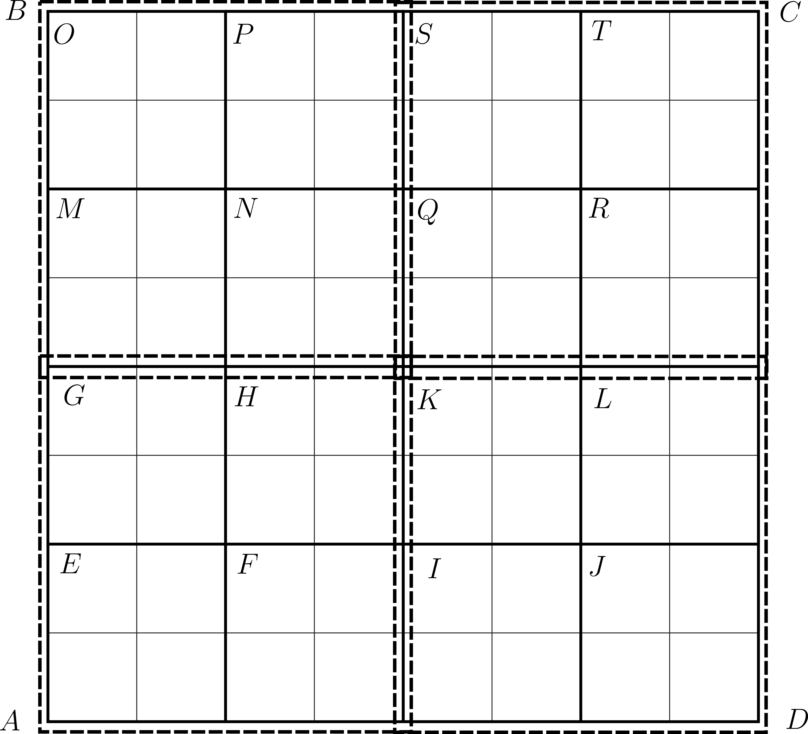
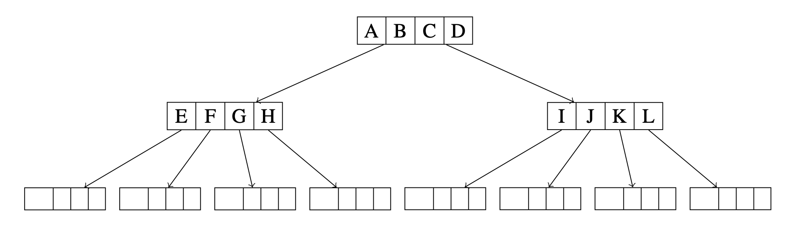
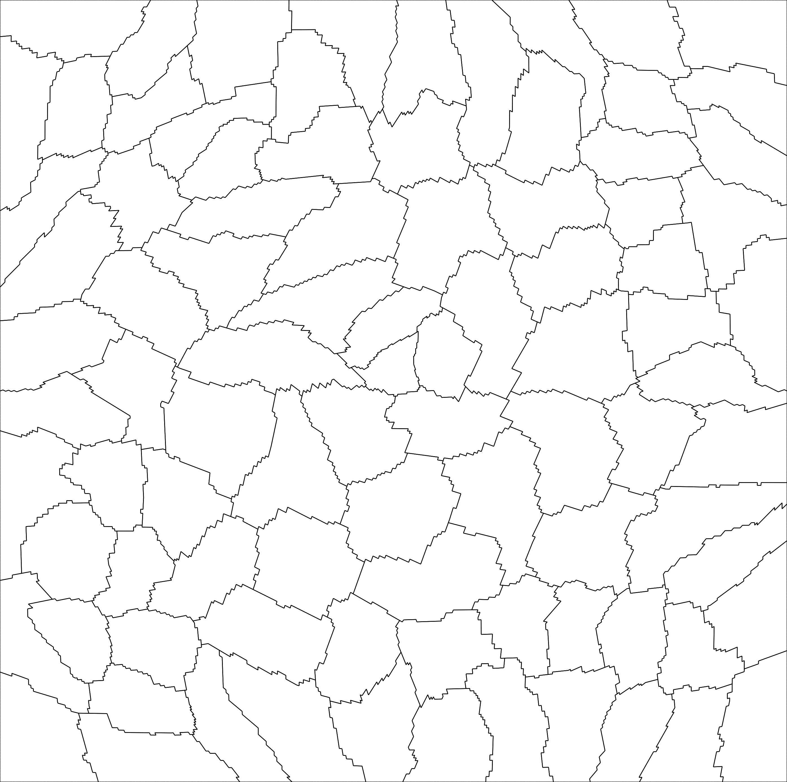
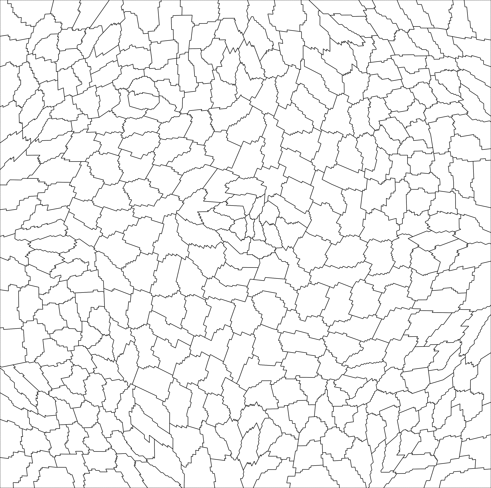
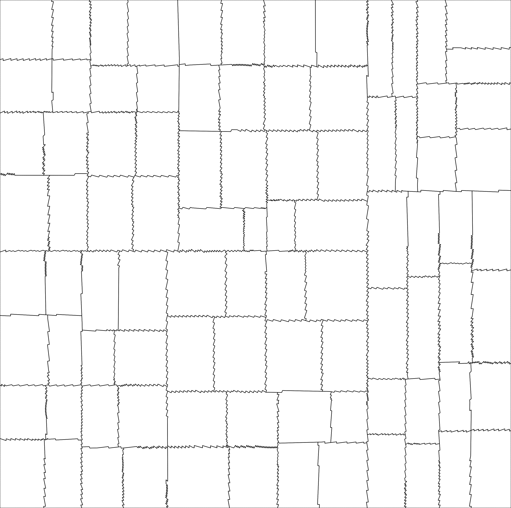
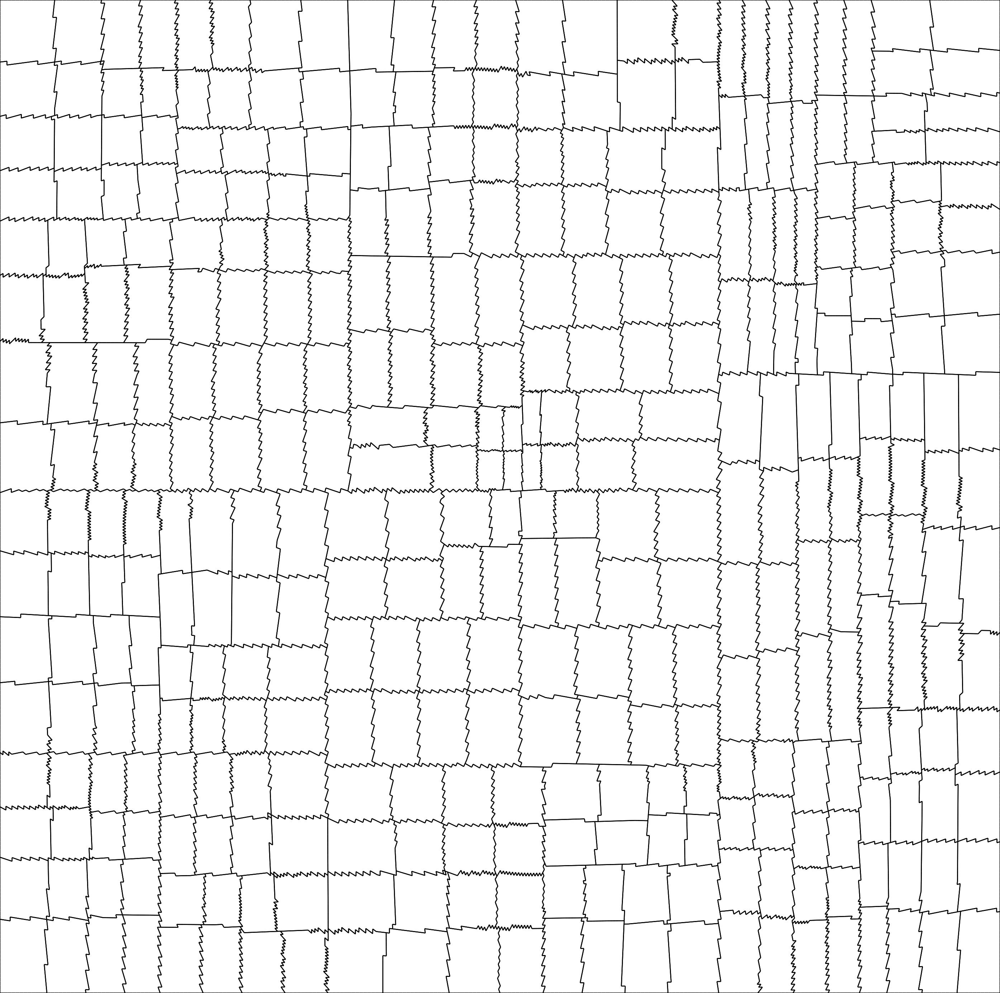
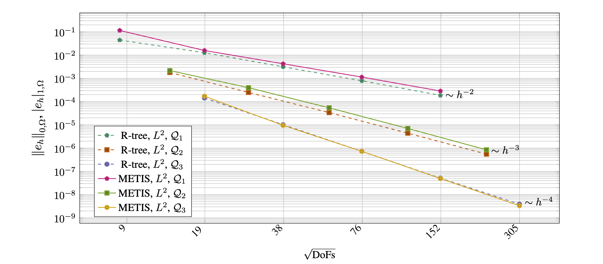

# A Discontinuous Galerkin solver for the Poisson problem on general polytopal meshes generated through mesh agglomeration

This program solves a Poisson problem on an agglomerated polytopal mesh
using a symmetric interior penalty discontinuous Galerkin (SIPG) method.
Agglomerates are constructed by an R-tree–based spatial indexing
strategy, following the approach proposed in [2]. 
In addition, a graph-based METIS partitioner is also provided in this program for comparison.

## Running the code:

As in the tutorial programs, type 

`cmake -DDEAL_II_DIR=/path/to/deal.II .` 

on the command line to configure the program. After that you can compile with `make` and run with either `make run` or using 

`./agglomeration_possion`

on the command line. 

## Problem description:

We consider the Poisson problem in a bounded, simply connected domain
@f$\Omega \subset \mathbb{R}^d @f$, @f$d = 2,3@f$.
The strong formulation reads
@f{align*}
  -\Delta u &= f  && \text{in } \Omega, \\
           u &= u_D && \text{on } \partial\Omega,
@f}
where the right-hand side satisfies $f \in L^2(\Omega)$ and the prescribed
Dirichlet data satisfy $u_D \in H^{1/2}(\partial\Omega)$.

The corresponding weak formulation is: find $u \in H^1(\Omega)$ with
$u = u_D$ on $\partial\Omega$ such that
@f{equation}
  \int_{\Omega} \nabla u \cdot \nabla v \,\mathrm d\mathbf{x}
  =\int_{\Omega} f\, v \,\mathrm d\mathbf{x}
  \qquad \text{for all } v \in H_0^1(\Omega).
@f}

## SIPG discretization on agglomerated polytopal meshes:

We discretize the weak formulation by a symmetric interior penalty
discontinuous Galerkin (SIPG) method on the agglomerated polytopal mesh
$\mathcal T_h$, whose elements $K \in \mathcal T_h$ are mutually disjoint
open polygons (for $d=2$) or polyhedra (for $d=3$).
For each element we denote its diameter by
@f[
  h_K := \operatorname{diam}(K).
@f]
The mesh skeleton is given by
@f[
  \Gamma := \bigcup_{K \in \mathcal T_h} \partial K,
@f]
and we denote by $\Gamma_{\mathrm{int}}$ the union of interior faces,
while $\Gamma_{\mathrm D} := \Gamma \cap \partial\Omega$ collects the
Dirichlet boundary faces.

The discrete space $V_h$ consists of element-wise polynomials of degree
at most $p$ on each $K \in \mathcal T_h$. For $u_h, v_h \in V_h$ we use
the broken gradient $\nabla_h$ and the standard jump and average
operators $[\![\cdot]\!]$ and $\{\!\!\{\cdot\}\!\!\}$ on faces.

The DG formulation reads: find $u_h \in V_h$ such that
@f{equation}
  B(u_h,v_h) = l(v_h)
  \qquad \forall\, v_h \in V_h,
@f}
with
@f{align*}
  B(u_h,v_h)
  &=
  \int_{\Omega} \nabla_h u_h \cdot \nabla_h v_h \,\mathrm d\mathbf{x}
  \\
  &\quad
  - \int_{\Gamma}
    \Bigl(
      \{\!\!\{\nabla u_h\}\!\!\} \cdot [\![v_h]\!]
      +
      \{\!\!\{\nabla v_h\}\!\!\} \cdot [\![u_h]\!]
    \Bigr)\,\mathrm d s
  \\
  &\quad
  + \int_{\Gamma} \sigma \,[\![u_h]\!] \cdot [\![v_h]\!] \,\mathrm d s,
@f}
and
@f{equation}
  l(v_h)
  =
  \int_\Omega f\, v_h \,\mathrm d\mathbf{x}
  +
  \int_{\Gamma_{\mathrm D}}
    u_D \bigl(\sigma v_h - \nabla v_h \cdot \mathbf n\bigr)\,\mathrm d s.
@f}

The penalty parameter is chosen as
@f{equation}
  \sigma(\mathbf x) = C_\sigma
  \begin{cases}
    \dfrac{p^2}{h_K}, &
      \text{if } \mathbf x \in \partial K \cap \partial\Omega, \\[0.5em]
    \dfrac{p^2}{\min\{h_K^+,h_K^-\}}, &
      \text{if } \mathbf x \in \Gamma_{\mathrm{int}},
  \end{cases}
@f}
where $h_K^\pm$ are the diameters of the two elements sharing the
interior face, $p$ is the polynomial degree, and we fix $C_\sigma = 10$ in this program.

This scheme is well posed and admits optimal-order a priori error
estimates. More precisely, assuming that $u|_K \in H^{s+1}(K)$ for all
$K \in \mathcal T_h$ and some $1 \le s \le p$, there exists a constant
$C > 0$, independent of $h$, such that
@f[
  \|u - u_h\|_{L^2(\Omega)}
  \le C\, h^{s+1} \, |u|_{H^{s+1}(\Omega)},
@f]
and
@f[
  \|\nabla(u - u_h)\|_{L^2(\Omega)}
  \le C\, h^{s} \, |u|_{H^{s+1}(\Omega)}.
@f]
We refer to [2] for details of the analysis.

## Agglomeration strategies
Agglomeration is a key ingredient for constructing polytopic meshes.
This program supports two strategies for generating agglomerates,
corresponding to the choices \texttt{metis} and \texttt{rtree}.

### METIS-based partitioning 
In the \emph{metis} option, the adjacency graph of the fine mesh is
constructed with one vertex per cell and edges between face-neighbouring
cells. This graph is then partitioned by the multilevel graph partitioner
METIS into a prescribed number of parts, and each part defines one
agglomerate; see~[3] for details.

### R-tree geometric partitioning 
In the `rtree` option, axis-aligned bounding boxes of all fine cells are
inserted into a spatial R-tree. Agglomerates are obtained by grouping the
cells whose bounding boxes belong to the same node at a user-selected
extraction level of the tree. This purely geometric strategy does not
require external graph partitioners and is typically fast and scalable.
The number and shape of the agglomerates are determined by the R-tree
structure and the chosen level; see~[2] for details.

The following images illustrate the R-tree-based agglomeration on a
structured fine mesh:

From left to right, these plots show the original fine mesh, the blocks
induced by the R-tree on the cell bounding boxes, and the corresponding
tree structure.

## Test case:

We consider the Poisson problem on the unit square $\Omega = (0,1)^2$
with the manufactured exact solution
@f[
  u(x,y) = \sin(\pi x)\sin(\pi y).
@f]
The corresponding right-hand side is
@f[
  f(x,y) = 2\pi^2 \sin(\pi x)\sin(\pi y).
@f]
This manufactured solution allows us to compute the global
$L^2$- and $H^1$-seminorm errors of the discrete solution in order to
assess the quality of the numerical approximation.

In this example, an unstructured fine mesh (e.g., a triangular mesh) is
used as the starting point. Agglomerates are then constructed by METIS
and by the R-tree strategy, leading to different polytopal meshes. The
following images compare the resulting agglomerates for two different
numbers of agglomerates:

These plots illustrate how the two strategies distribute and shape the
agglomerates on the same underlying unstructured mesh.

The corresponding error curves are shown below:

The figure reports the $L^2$- and $H^1$-seminorm errors with respect to
the manufactured solution $u$. Optimal convergence rates are observed
for all polynomial degrees and for both agglomeration strategies. In
addition, the curves associated with the R-tree approach are consistently
lower than or comparable to those obtained with METIS-based partitioning.

The construction of an R-tree spatial index on an arbitrary fine grid
provides a natural and efficient agglomeration strategy with the
following features:

- fully automated, robust, and dimension-independent;
- it produces a balanced and nested hierarchy of agglomerates;
- the shape of the agglomerates closely follows their axis-aligned
  bounding boxes.

These properties make the R-tree approach an attractive alternative to
graph-based agglomeration methods (see [3] for more details).

## References 
* [1] Di Pietro, Daniele Antonio and Ern, Alexandre (2012), Mathematical Aspects of Discontinuous Galerkin Methods. ISBN: [978-3-642-22980-0](https://www.springer.com/gp/book/9783642229794)
* [2] Marco Feder, Andrea Cangiani and Luca Heltai (2025), R3MG: R-tree based agglomeration of polytopal grids with applications to multilevel methods. DOI: [10.1016/j.jcp.2025.113773](https://doi.org/10.1016/j.jcp.2025.113773)
* [3] George Karypis and Vipin Kumar, A fast and high quality multilevel scheme for partitioning irregular graphs. DOI: [10.1137/S1064827595287997](https://doi.org/10.1137/S1064827595287997)

